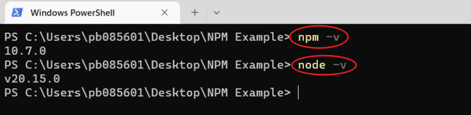

# Javascript Example Code (gdhblog.com)
Record the code from my blog category on Javascript.

## 2024-11-05 NPM初体验

> NPM，全称为 Node Package Manager，是一个用于管理和共享 JavaScript 代码包的工具。它是 Node.js 平台的默认包管理器，允许开发者从 NPM 仓库中下载并安装各种 JavaScript 包和工具。通过 NPM，开发者可以轻松地查找、安装、更新和删除依赖包，使得 JavaScript 项目的开发和维护更加高效和便捷。
>
> NPM 除了用于安装和管理包之外，还提供了一些其他功能，比如发布自己的包到 NPM 仓库、管理项目的依赖关系、运行脚本命令等。开发者可以通过 NPM 来构建和管理他们的 JavaScript 项目，以及与其他开发者分享他们的代码作品。
>
> 总的来说，NPM 是一个强大的工具，为 JavaScript 社区提供了便利的包管理功能，促进了开发者之间的协作和知识共享。

### 实例1-创建预设的文件夹（发布NPM）

1，确保环境安装了 node.js 和 npm



2，创建并进入文件夹

创建

```powershell
mkdir FolderCreator
```

进入

```powershell
cd FolderCreator
```

3，初始化npm项目

```powershell
npm init -y
```

> `npm init -y` 是一个用于快速生成项目的 package.json 文件的命令。在这个命令中，`npm init` 是用于初始化一个新的 Node.js 项目的命令，而 `-y` 参数表示在执行初始化时使用默认值，而不需要用户输入任何信息。
>
> 具体来说，执行 `npm init -y` 会自动创建一个默认的 package.json 文件，其中包含一些基本的信息，如项目名称、版本号、作者等。这样可以快速创建一个简单的项目结构，而无需逐个回答 npm init 提出的各种问题。
>
> 使用 `npm init -y` 命令可以节省时间，特别是在创建临时项目或试验性项目时。然后开发者可以根据需要再进行手动调整和配置。


4，创建脚本文件，并添加逻辑


逻辑代码：

```javascript
#!/usr/bin/env node
const fs = require('fs');
const path = require('path');
const folders = [
    '10 项目管理/10-01 要件定义',
    '10 项目管理/10-02 要件定义交付',
    '10 项目管理/10-03 项目主计划',
    '10 项目管理/10-04 项目周报',
    '10 项目管理/10-05 会议纪要',
    '20 业务调研及要件定义/20-01 调研计划',
    '20 业务调研及要件定义/20-02 调研会议资料',
    '20 业务调研及要件定义/20-03 调研会议会议纪要',
    '20 业务调研及要件定义/20-04 业务需求分析',
    '20 业务调研及要件定义/20-05 业务蓝图',
    '20 业务调研及要件定义/20-06 课题研讨',
    '20 业务调研及要件定义/20-07 功能设计/历史版本',
    '30 技术概要及详细设计',
    '40 系统测试和培训/40-01 系统测试',
    '40 系统测试和培训/40-02 用户培训',
    '50 系统上线/50-01 系统切换方案',
    '50 系统上线/50-02 用户及权限配置',
    '50 系统上线/50-03 数据初始化',
    '50 系统上线/50-04 系统上线汇报材料',
    '60 上线后运维',
    '70 配置相关',
    '80 数据清理/80-01 数据清理方案',
    '80 数据清理/80-02 数据清理模板',
    '80 数据清理/80-03 数据清理结果'
];
const rootPath = process.cwd();
folders.forEach(folder => {
    const fullPath = path.join(rootPath, folder);
    fs.mkdirSync(fullPath, { recursive: true });
});
```

5，更新package.json

在 package.json 文件中，添加一个 bin 字段，以便将该脚本作为命令行工具使用

```json
"bin": {
    "create-folders": "./createFolders.js"
}
```

6，脚本文件添加 `#!/usr/bin/env node`

> `#!/usr/bin/env node` 这行代码是一个称为 shebang 的特殊注释，通常出现在 Unix-like 系统的脚本文件的第一行。它告诉操作系统应该使用哪个解释器来执行这个脚本文件。在这个例子中，`#!/usr/bin/env node` 意味着使用环境中的 Node.js 解释器来执行这个脚本。

7，使用 npm link 命令将您的包链接到全局，以便从命令行直接调用

```powershell
npm link
```

8，运行脚本

随便在桌面新建个文件夹，然后命令行输入：

```powershell
create-folders
```

9，将上述写的包发布NPM

（1）创建NPM账号，官网：https://www.npmjs.com

（2）登录NPM，在终端输入

```powershell
npm login
```

（3）准备发布

调整package.json信息

- name 包的名称，需要保证唯一
- version
- description
- main 入口文件
- bin 执行命令工具路径

```json
{
  "name": "gdhblog_folder_creator",
  "version": "1.0.0",
  "main": "index.js",
  "scripts": {
    "test": "echo \"Error: no test specified\" && exit 1"
  },
  "keywords": [],
  "author": "Donghai Gong",
  "license": "ISC",
  "description": "A simple tool to create a predefined folder structure in the current directory.",
  "bin": {
    "create-folders": "./createFolders.js"
  }
}
```

调整好package.json信息后，终端输入 `npm pack` 生成 .tgz 文件


（4）发布

```powershell
npm publish
```

（5）备注

- 发布包时，选择公开还是私有化
  - 公开：（默认）`npm publish`
  - 私有：在package.json添加 `"private" : ture`

10，验证发布

等几分钟后，在NPM就能看到


11，使用上述发布的NPM包

（1）新建并进入文件夹

```powershell
mkdir Test_FolderCreator

cd Test_FolderCreator
```


（2）安装

```powershell
npm i gdhblog_foldercreator
```

> - `npm`: 是 Node.js 平台的包管理工具，用于下载、安装和管理 JavaScript 包。
> - `i`（缩写形式）或 `install`（完整形式）: 是 npm 安装包的命令。
> - `gdhblog_foldercreator`: 是要安装的 npm 包的名称。


（3）执行命令

也就是刚才我们在package.json文件中配置的`bin`

```powershell
create-folders
```


